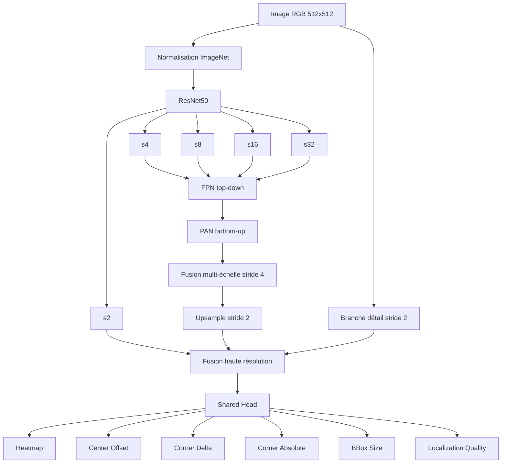

# PlankEye V7 — Détection multi-planches par quadrilatères

> **Version du modèle :** `v7-resnet50-fpn-pan-dual-corners-quality`  
> **Framework :** PyTorch  
> **Backbone :** ResNet50 pré-entraîné ImageNet  
> **Entrée de référence :** `512 × 512` RGB  
> **Sortie principale :** détection d'une ou plusieurs planches sous forme de quadrilatères à 4 coins  
> **Entraînement prévu :** GPU NVIDIA, DDP multi-GPU, AMP FP16, EMA, reprise complète par checkpoint  
> **Fichiers principaux :** `model_v7.py` et `train_v7.py`

---

## 1. Objectif du projet

PlankEye V7 est un modèle de vision par ordinateur spécialisé dans la **détection précise des quatre coins d'une ou plusieurs planches** présentes dans une image.

Le but n'est pas simplement de prédire une boîte rectangulaire classique du type :

```text
x_min, y_min, x_max, y_max
```

mais de reconstruire directement la géométrie réelle de la planche avec quatre points :

```text
P1 = (x1, y1)
P2 = (x2, y2)
P3 = (x3, y3)
P4 = (x4, y4)
```

Une planche est donc représentée par un quadrilatère :

```text
P1 ───────── P2
│             \
│              \
P4 ─────────── P3
```

Le quadrilatère peut être :

- incliné ;
- vu en perspective ;
- trapézoïdal ;
- partiellement déformé par la perspective de la caméra ;
- petit ou grand dans l'image ;
- accompagné d'autres planches.

Le modèle ne force donc **pas** les quatre angles à être égaux à 90°. Il apprend la géométrie présente dans les annotations.

---

## 2. Problème traité

Le modèle doit résoudre simultanément plusieurs tâches :

1. déterminer **combien de planches** sont visibles ;
2. trouver le **centre approximatif** de chaque planche ;
3. affiner la position exacte de ce centre ;
4. prédire les **quatre coins** ;
5. estimer la taille de l'objet ;
6. estimer si la localisation géométrique est fiable ;
7. éliminer les détections dupliquées ;
8. produire une sortie utilisable directement pour un détourage ou un traitement géométrique.

PlankEye V7 est donc plus proche d'un détecteur spécialisé de polygones que d'un simple réseau de régression.

---

# 3. Format des données

## 3.1 Organisation du dataset

Le script attend la structure suivante :

```text
data_kaggle_2_propre/
├── images/
│   ├── image1.jpg
│   ├── image2.jpg
│   ├── image3.png
│   └── ...
└── labels/
    ├── label1.txt
    ├── label2.txt
    ├── label3.txt
    └── ...
```

Le code accepte plusieurs extensions d'image :

```text
.jpg
.jpeg
.png
.bmp
.tif
.tiff
.webp
```

Pour une image appelée :

```text
image491.jpg
```

le système recherche notamment :

```text
label491.txt
image491.txt
```

Cette tolérance permet de travailler avec les deux conventions de nommage utilisées dans le projet.

---

## 3.2 Format d'une annotation

Chaque ligne représente une planche :

```text
classe x1 y1 x2 y2 x3 y3 x4 y4
```

Exemple :

```text
0 0.134776 0.491204 0.688738 0.237963 0.776590 0.525926 0.174400 0.875463
```

Les coordonnées sont normalisées dans `[0, 1]`.

Cela signifie :

```text
x_pixel = x_normalisé × largeur_image
y_pixel = y_normalisé × hauteur_image
```

Le projet utilise actuellement une seule classe :

```python
NUM_CLASSES = 1
```

donc la classe est normalement :

```text
0
```

---

## 3.3 Plusieurs planches dans une image

Une image peut contenir plusieurs objets.

Exemple :

```text
0 x1 y1 x2 y2 x3 y3 x4 y4
0 x1 y1 x2 y2 x3 y3 x4 y4
0 x1 y1 x2 y2 x3 y3 x4 y4
```

Ici, l'image contient trois planches.

Le modèle et le DataLoader ont été construits pour supporter ce cas.

---

# 4. Vérification du dataset avant entraînement

`train_v7.py` effectue un scan avant l'entraînement.

Il vérifie notamment :

- que le dossier `images/` existe ;
- que le dossier `labels/` existe ;
- que l'image peut être ouverte par OpenCV ;
- que chaque ligne contient exactement 9 valeurs ;
- que la classe est valide ;
- que les coordonnées sont numériques ;
- qu'il n'y a pas de `NaN` ou `Inf` ;
- que les coordonnées restent proches de `[0,1]` ;
- que le quadrilatère possède une aire non nulle ;
- que le quadrilatère est convexe ;
- qu'au moins un objet valide existe dans le fichier.

Une petite tolérance de coordonnées est acceptée avant clamp :

```python
clamp_tolerance = 0.02
```

Puis les coordonnées sont ramenées dans :

```text
[0, 1]
```

L'aire minimale d'un label normalisé est :

```python
min_area = 1e-5
```

---

# 5. Ordre des quatre coins

L'ordre brut des coins n'a pas besoin d'être parfaitement identique dans tous les labels.

Le code réordonne les points de manière stable autour du centre du quadrilatère.

De plus, pendant la loss, le modèle teste **8 permutations valides** :

```text
4 permutations cycliques
+
4 permutations cycliques inversées
=
8 possibilités
```

Exemples :

```text
P1 P2 P3 P4
P2 P3 P4 P1
P3 P4 P1 P2
P4 P1 P2 P3
```

et les mêmes dans le sens inverse.

Le meilleur appariement entre prédiction et vérité terrain est sélectionné automatiquement.

### Pourquoi ?

Une même planche peut être annotée :

```text
haut-gauche → haut-droite → bas-droite → bas-gauche
```

ou commencer à un autre coin.

Sans cette logique, le réseau pourrait recevoir une forte erreur alors que les quatre coins prédits sont géométriquement corrects.

---

# 6. Prétraitement des images

## 6.1 Chargement

Les images sont chargées avec OpenCV puis converties :

```text
BGR → RGB
```

Le tenseur final est :

```text
[B, 3, H, W]
```

avec des valeurs :

```text
[0, 1]
```

---

## 6.2 Letterbox

Les images ne sont pas étirées directement en carré.

Le code utilise un **letterbox**.

Exemple :

```text
image originale : 1920 × 1080

         ↓ resize en conservant le ratio

image redimensionnée

         ↓ ajout de padding

512 × 512
```

Le fond de padding vaut :

```text
114
```

Cette méthode évite de déformer artificiellement la planche.

Pendant l'entraînement, la position du padding peut être aléatoire.

En validation, le padding est centré.

Les coordonnées des quatre coins sont recalculées exactement après le redimensionnement et le padding.

---

# 7. Augmentation de données on-the-fly

Les augmentations sont appliquées pendant l'entraînement.

Aucune nouvelle image n'a besoin d'être écrite sur disque.

À chaque epoch, une même image peut donc apparaître sous une forme différente.

## 7.1 Augmentations géométriques

Configuration actuelle :

| Augmentation | Probabilité / plage |
|---|---:|
| Flip horizontal | `0.50` |
| Flip vertical | `0.05` |
| Rotation 90° | `0.15` |
| Affine + perspective | `0.60` |
| Rotation libre | `±12°` |
| Scale | `0.90 → 1.10` |
| Translation | jusqu'à `4 %` |
| Perspective | jusqu'à `2.5 %` |

Les quatre coins sont transformés avec exactement la même transformation que l'image.

Une transformation est rejetée si elle produit un quadrilatère :

- hors image ;
- non fini ;
- trop petit ;
- non convexe.

La transformation affine/perspective peut être retentée plusieurs fois.

---

## 7.2 Augmentations photométriques

| Augmentation | Probabilité |
|---|---:|
| Brightness / Contrast | `0.55` |
| Gamma | `0.25` |
| HSV | `0.35` |
| Grayscale | `0.04` |
| Gaussian Blur | `0.10` |
| Motion Blur | `0.08` |
| Gaussian Noise | `0.16` |
| JPEG artifacts | `0.10` |
| Sharpen | `0.10` |
| Gradient d'éclairage | `0.18` |

Ces transformations ne changent pas les coordonnées des coins.

Elles permettent au modèle d'être moins dépendant :

- de l'exposition ;
- des ombres ;
- du contraste ;
- de la compression ;
- du flou ;
- du bruit caméra ;
- des variations de couleur.

---

# 8. Vue globale de PlankEye V7

Le pipeline principal est :



Le modèle combine donc :

```text
ResNet50
+
FPN
+
PAN
+
branche haute résolution
+
fusion multi-échelle
+
6 têtes de prédiction
```

---

# 9. Backbone ResNet50

## 9.1 Pourquoi ResNet50 ?

Le backbone sert à extraire les caractéristiques visuelles :

- contours ;
- textures ;
- lignes ;
- angles ;
- formes ;
- structures plus complexes.

La V7 utilise :

```python
torchvision.models.resnet50
```

avec les poids ImageNet par défaut lorsque le pré-entraînement est activé.

Le backbone possède plusieurs niveaux :

```text
entrée
  ↓
conv1
  ↓
s2
  ↓
maxpool
  ↓
layer1 → s4
  ↓
layer2 → s8
  ↓
layer3 → s16
  ↓
layer4 → s32
```

Les strides correspondent à la réduction spatiale par rapport à l'image originale.

Pour une image de `512 × 512` :

```text
s2  ≈ 256 × 256
s4  ≈ 128 × 128
s8  ≈  64 × 64
s16 ≈  32 × 32
s32 ≈  16 × 16
```

Canaux principaux :

```text
s2  :   64
s4  :  256
s8  :  512
s16 : 1024
s32 : 2048
```

---

# 10. Normalisation ImageNet intégrée au modèle

Le DataLoader renvoie simplement une image RGB dans `[0,1]`.

La normalisation ImageNet est effectuée dans `PlankEyeV7.forward()` :

```python
mean = [0.485, 0.456, 0.406]
std  = [0.229, 0.224, 0.225]
```

Donc :

```text
DataLoader
   ↓
RGB [0,1]
   ↓
PlankEyeV7
   ↓
normalisation ImageNet
   ↓
ResNet50
```

Cela évite de dupliquer la normalisation dans plusieurs scripts d'inférence.

---

# 11. BatchNorm du backbone

Les `BatchNorm2d` du ResNet50 sont gelées par défaut.

Cela signifie :

```text
running mean     gelée
running variance gelée
gamma/beta       gelés
```

Pourquoi ?

Le training est réalisé avec un très petit batch par GPU.

Dans la configuration Kaggle actuelle :

```text
Batch / GPU = 1
```

Les statistiques BatchNorm calculées sur un batch aussi petit seraient très bruitées.

Les couches ajoutées par PlankEye utilisent principalement **GroupNorm**, qui ne dépend pas de la taille du batch.

---

# 12. FPN — Feature Pyramid Network

Le FPN récupère :

```text
s4
s8
s16
s32
```

et les projette vers un nombre commun de canaux :

```python
neck_channels = 192
```

Le chemin top-down est approximativement :

```text
s32
 ↓
p32
 ↑ upsample
s16 + p32
 ↓
p16
 ↑ upsample
s8 + p16
 ↓
p8
 ↑ upsample
s4 + p8
 ↓
p4
```

### Intérêt

Les couches profondes voient mieux le contexte global.

Les couches peu profondes gardent davantage de précision spatiale.

Le FPN mélange donc :

```text
information sémantique
+
précision spatiale
```

---

# 13. PAN — Path Aggregation Network

Après le chemin FPN descendant, le modèle effectue un chemin remontant :

```text
p4
 ↓ stride 2
n8
 ↓ stride 2
n16
 ↓ stride 2
n32
```

Cette étape permet de réinjecter les détails des niveaux fins vers les niveaux plus profonds.

Le modèle bénéficie donc de deux directions :

```text
FPN : profond → fin
PAN : fin → profond
```

---

# 14. Fusion multi-échelle pondérée

Les niveaux :

```text
p4
n8
n16
n32
```

sont tous ramenés à la résolution `stride 4`.

Ils sont ensuite combinés par `WeightedFeatureFusion`.

Les poids de fusion sont **appris par le réseau**.

Conceptuellement :

```text
F = w1 × p4
  + w2 × n8
  + w3 × n16
  + w4 × n32
```

Les poids sont forcés positifs puis normalisés.

Le modèle peut donc apprendre qu'une échelle est plus utile qu'une autre pour la détection des planches.

---

# 15. Branche de détails haute résolution

La localisation des coins demande beaucoup de précision.

Une sortie uniquement en stride 4 ou stride 8 perdrait une partie des détails.

V7 possède donc une branche dédiée travaillant directement à partir de l'image brute :

```text
RGB
 ↓
Conv stride 2
 ↓
Residual block
 ↓
Conv
 ↓
Residual block
 ↓
detail_s2
```

En parallèle, le modèle utilise également :

```text
feature s2 du ResNet50
```

et le résultat FPN/PAN ré-échantillonné vers stride 2.

La fusion finale est :

```text
FPN/PAN stride 2 : 192 canaux
+
ResNet s2        :  64 canaux
+
detail branch    :  64 canaux
--------------------------------
concaténation    : 320 canaux
```

puis réduction vers :

```python
highres_channels = 160
```

Cette sortie `stride 2` est utilisée par toutes les têtes.

Pour `512 × 512`, la carte de prédiction mesure donc environ :

```text
256 × 256
```

---

# 16. Blocs utilisés dans le neck et les heads

## 16.1 ConvGNAct

Bloc standard :

```text
Convolution
   ↓
GroupNorm
   ↓
SiLU
```

GroupNorm est choisi pour sa stabilité avec de petits batches.

---

## 16.2 ResidualDWBlock

Bloc résiduel léger :

```text
entrée
  │
  ├──────────────────────────────┐
  ↓                              │
Depthwise Conv                   │
  ↓                              │
Pointwise Conv                   │
  ↓                              │
Pointwise Conv                   │
  ↓                              │
Squeeze-and-Excitation           │
  ↓                              │
Dropout éventuel                 │
  ↓                              │
addition résiduelle ◄────────────┘
  ↓
SiLU
```

Le depthwise separable permet de limiter le coût par rapport à des convolutions pleines.

---

## 16.3 Squeeze-and-Excitation

Le bloc SE apprend à donner plus ou moins d'importance à certains canaux de features.

Il effectue :

```text
feature map
  ↓
global average pooling
  ↓
petit réseau 1×1
  ↓
sigmoid
  ↓
pondération des canaux
```

---

# 17. CoordConv dans les têtes

Chaque `PredictionTower` commence par une CoordConv.

En plus des features classiques, elle ajoute trois cartes :

```text
X
Y
R
```

avec :

```text
X = position horizontale
Y = position verticale
R = distance radiale au centre
```

Cela aide le réseau à comprendre explicitement **où** se trouve une feature dans l'image.

C'est utile pour une tâche de régression de coordonnées.

---

# 18. Les six têtes de sortie

PlankEye V7 ne produit pas une seule sortie.

Il possède six têtes spécialisées.

Pour une image `512 × 512`, toutes travaillent sur une grille d'environ `256 × 256`.

---

## 18.1 Heatmap de centres

Sortie :

```text
[B, 1, 256, 256]
```

Elle prédit la probabilité qu'une cellule corresponde au centre d'une planche.

Le modèle utilise une approche proche de CenterNet :

```text
pas de liste fixe d'ancres
pas de bounding boxes prédéfinies
détection à partir de pics de heatmap
```

---

## 18.2 Center Offset

Sortie :

```text
[B, 2, 256, 256]
```

La grille stride 2 donne un centre discret.

L'offset corrige la position à l'intérieur de la cellule.

La sortie est bornée avec :

```python
0.5 * tanh(...)
```

donc :

```text
offset_x ∈ [-0.5, +0.5]
offset_y ∈ [-0.5, +0.5]
```

Le centre final est :

```text
center_x = (cell_x + 0.5 + offset_x) / largeur_grille
center_y = (cell_y + 0.5 + offset_y) / hauteur_grille
```

---

## 18.3 Corner Delta — représentation principale

Sortie :

```text
[B, 8, 256, 256]
```

Il faut huit nombres :

```text
4 coins × 2 coordonnées = 8
```

Mais ces coordonnées ne représentent pas directement des positions absolues.

Elles représentent :

```text
coin_i - centre
```

Donc :

```text
coin_i = centre_prédit + delta_i
```

Cette représentation est la représentation principale de V7.

### Pourquoi ?

Une fois le centre trouvé, le réseau apprend surtout la **forme locale de l'objet autour de son centre**.

Cela rend la tâche plus structurée.

---

# 19. Corner Absolute — représentation auxiliaire

La deuxième tête de coins produit aussi :

```text
[B, 8, 256, 256]
```

mais directement sous forme :

```text
(x1,y1), (x2,y2), (x3,y3), (x4,y4)
```

dans `[0,1]`.

Cette tête est passée dans un `sigmoid`.

V7 possède donc deux chemins indépendants :

```text
centre + deltas
```

et :

```text
coins absolus
```

Cette redondance volontaire permet d'imposer de la cohérence.

---

# 20. Dual Corner Representation

C'est l'une des idées centrales de V7.

Le modèle prédit les coins deux fois :

```text
Méthode A :
centre prédit
+
vecteurs relatifs
=
coins reconstruits


Méthode B :
coins absolus directement
```

Puis plusieurs losses vérifient que les deux chemins sont d'accord.

Cela permet de réduire les situations où :

```text
le centre est bon mais les coins sont mauvais
```

ou :

```text
les coins absolus semblent plausibles mais ne correspondent pas au centre détecté
```

---

# 21. BBox Size Head

Sortie :

```text
[B, 2, 256, 256]
```

Elle prédit :

```text
largeur normalisée
hauteur normalisée
```

du bounding box englobant le quadrilatère.

Cette tête n'est pas utilisée comme représentation finale de la planche.

Elle sert principalement comme information auxiliaire et contrôle de cohérence.

---

# 22. Localization Quality Head

Sortie :

```text
[B, 1, 256, 256]
```

La heatmap répond :

> « Y a-t-il probablement une planche ici ? »

La quality head répond plutôt :

> « Si une planche est détectée ici, les quatre coins semblent-ils précis ? »

Pendant l'entraînement, la cible de qualité est calculée à partir de l'erreur actuelle des coins.

Forme simplifiée :

```text
quality_target = exp(-corner_error / tau)
```

avec :

```python
QUALITY_TAU = 0.035
```

Une faible erreur donne une qualité proche de `1`.

Une grosse erreur géométrique donne une qualité plus faible.

---

# 23. Création de la heatmap cible

Le centre d'une planche n'est pas représenté uniquement par un pixel égal à 1.

Le code dessine une gaussienne autour du centre.

Le sigma dépend de la taille de l'objet :

```text
sigma ∝ sqrt(width × height)
```

avec :

```python
GAUSSIAN_MIN_SIGMA = 1.15
GAUSSIAN_MAX_SIGMA = 5.0
GAUSSIAN_SIZE_DIVISOR = 18.0
```

Les gros objets peuvent donc avoir une région centrale légèrement plus large.

---

# 24. Collision de centres dans la même cellule

La grille finale est en stride 2.

Il est possible que deux objets aient leur centre dans la même cellule.

Or une cellule ne peut stocker qu'un seul ensemble de régressions.

Dans ce cas, le code garde l'objet dont le centre réel est **le plus proche du centre de la cellule**.

La heatmap peut toujours contenir l'information des gaussiennes, mais une seule cible de régression occupe la cellule.

---

# 25. Fonction de coût globale

V7 optimise plusieurs objectifs simultanément.

La loss totale est :

```text
L_total =
    1.00 × L_heatmap
  + 1.00 × L_offset
  + 6.00 × L_corner_delta
  + 2.00 × L_corner_abs
  + 4.00 × L_reconstruction
  + 0.50 × L_size
  + 1.50 × L_geometry
  + 0.75 × L_dual_consistency
  + 0.50 × L_center_consistency
  + 0.25 × L_quality
```

Les poids actuels montrent clairement la priorité :

```text
corner_delta       très important
reconstruction     très important
corner_abs         auxiliaire fort
géométrie          régularisation importante
```

---

# 26. Heatmap loss

La heatmap utilise une focal loss de type CenterNet.

Elle augmente l'importance des exemples difficiles et limite la domination de l'immense quantité de pixels de fond.

Cela est important parce qu'une carte :

```text
256 × 256
```

contient :

```text
65 536 cellules
```

alors qu'une image peut n'avoir que quelques planches.

---

# 27. Corner Delta Loss

La tête relative utilise une `SmoothL1Loss`.

Le matching teste les huit permutations des coins.

La représentation relative possède le poids le plus élevé :

```python
LOSS_W_CORNER_DELTA = 6.0
```

Lors du choix de la meilleure permutation, le critère est :

```text
0.75 × erreur relative
+
0.25 × erreur absolue
```

La représentation relative pilote donc davantage l'appariement.

---

# 28. Corner Absolute Loss

La tête absolue est également supervisée avec Smooth L1.

Son poids est :

```python
LOSS_W_CORNER_ABS = 2.0
```

Elle agit comme deuxième estimation indépendante.

---

# 29. Reconstruction Loss

Le modèle reconstruit :

```text
coin_reconstruit =
centre_prédit + delta_prédit
```

puis compare ce coin à la vérité terrain absolue.

Poids :

```python
LOSS_W_RECONSTRUCTION = 4.0
```

Cette loss relie directement :

```text
heatmap / center offset
```

à :

```text
corner delta
```

---

# 30. Dual Consistency Loss

La prédiction relative reconstruite est comparée à la prédiction absolue :

```text
center + delta
≈
absolute_corner
```

Poids :

```python
LOSS_W_DUAL_CONSISTENCY = 0.75
```

Le réseau est ainsi pénalisé si ses deux représentations racontent deux géométries différentes.

---

# 31. Center Consistency Loss

Le centroïde des quatre coins absolus doit être proche du centre prédit :

```text
mean(P1, P2, P3, P4)
≈
center
```

Poids :

```python
LOSS_W_CENTER_CONSISTENCY = 0.50
```

---

# 32. Geometry Loss

La géométrie n'impose pas une planche rectangulaire parfaite.

Elle compare la **forme prédite** à la **forme annotée**.

Sous-losses :

```text
aire
direction des côtés
longueur des côtés
longueur des diagonales
angles
convexité / orientation
```

Poids internes :

```text
area       = 1.00
direction  = 0.50
length     = 0.50
diagonal   = 0.25
angle      = 0.25
convexity  = 0.25
```

Puis l'ensemble est multiplié par :

```python
LOSS_W_GEOMETRY = 1.50
```

---

## 32.1 Aire

Le modèle compare l'aire du quadrilatère prédit à celle du quadrilatère cible.

La comparaison est normalisée par la taille de l'objet afin que les grandes planches ne dominent pas automatiquement les petites.

---

## 32.2 Direction des côtés

Pour chaque côté :

```text
P1 → P2
P2 → P3
P3 → P4
P4 → P1
```

le modèle compare le vecteur directionnel prédit à celui de la vérité terrain.

---

## 32.3 Longueur des côtés

Le modèle compare les quatre longueurs.

Elles sont normalisées par une échelle dépendant de la cible.

---

## 32.4 Diagonales

Les deux diagonales :

```text
P1 ↔ P3
P2 ↔ P4
```

sont comparées.

Cela stabilise la structure globale du quadrilatère.

---

## 32.5 Angles

V7 **ne demande pas que les angles valent 90°**.

Il compare le cosinus de chaque angle prédit au cosinus de l'angle correspondant dans l'annotation.

C'est essentiel avec une caméra en perspective.

Une vraie planche rectangulaire dans le monde 3D peut apparaître trapézoïdale dans l'image 2D.

---

## 32.6 Convexité

La loss utilise les produits vectoriels successifs pour encourager :

- une orientation cohérente ;
- un quadrilatère non croisé ;
- une forme convexe.

---

# 33. Prédiction géométrique fusionnée

Pour la geometry loss et le décodage, V7 fusionne les deux représentations.

Valeur par défaut :

```python
DEFAULT_RELATIVE_CORNER_BLEND = 0.75
```

Donc :

```text
coins_fusionnés =
0.75 × coins_reconstruits_depuis_centre
+
0.25 × coins_absolus
```

La représentation relative reste dominante.

---

# 34. Initialisation des têtes

Le modèle initialise certaines sorties de façon volontairement prudente.

### Heatmap

Le biais initial vaut environ :

```python
-4.595
```

soit une probabilité foreground proche de :

```text
1 %
```

Le réseau ne commence donc pas en considérant toute l'image comme une planche.

### Quality

Biais initial :

```python
-2.197
```

soit environ :

```text
10 %
```

### Size

Biais initial :

```python
-0.85
```

qui correspond après sigmoid à environ :

```text
0.30
```

### Régressions

Les têtes :

```text
corner delta
corner absolute
center offset
```

reçoivent une initialisation proche de zéro.

---

# 35. Entraînement multi-GPU avec DDP

Le projet utilise :

```text
DistributedDataParallel
```

avec `torchrun`.

Commande de principe :

```bash
python -m torch.distributed.run \
    --standalone \
    --nproc_per_node 2 \
    train_v7.py ...
```

Avec deux Tesla T4 :

```text
Rank 0 → GPU 0
Rank 1 → GPU 1
```

Chaque GPU possède une copie complète du modèle.

Les gradients sont synchronisés entre les deux processus.

Important :

```text
2 × 15 Go de VRAM
```

ne signifie pas :

```text
30 Go disponibles pour une seule image
```

Chaque GPU doit faire tenir sa propre copie du réseau et son propre micro-batch dans environ 15 Go.

---

# 36. Configuration Kaggle actuellement utilisée

La configuration recommandée pour le V7 sur `2 × Tesla T4` est actuellement :

```python
EPOCHS = 180
IMAGE_SIZE = 512

BATCH_SIZE = 1
GRAD_ACCUM = 8
NUM_GPUS = 2

WORKERS = 2

VAL_RATIO = 0.10

LEARNING_RATE = 2e-4
BACKBONE_LR_MULT = 0.25

WEIGHT_DECAY = 1e-4

WARMUP_EPOCHS = 3.0
MIN_LR_RATIO = 0.03

MAX_GRAD_NORM = 10.0

SAVE_EVERY = 5
```

Le batch effectif vaut :

```text
batch_gpu × nombre_gpu × accumulation
=
1 × 2 × 8
=
16
```

Seulement une image est présente à la fois dans la VRAM de chaque GPU, mais les gradients de huit micro-batches sont accumulés avant chaque mise à jour de poids.

---

# 37. Gradient Accumulation

Avec :

```text
BATCH_SIZE = 1
GRAD_ACCUM = 8
2 GPU
```

le fonctionnement est :

```text
micro-batch 1 → backward
micro-batch 2 → backward
micro-batch 3 → backward
...
micro-batch 8 → backward
                ↓
          optimizer.step()
```

Le modèle obtient donc un comportement proche d'un batch global de 16 sans avoir besoin de mettre 8 images simultanément sur chaque T4.

DDP utilise `no_sync()` pendant les micro-batches intermédiaires afin d'éviter une synchronisation réseau inutile à chaque backward.

---

# 38. AMP — Automatic Mixed Precision

Le forward du CNN utilise AMP FP16.

Principe :

```text
CNN forward
   ↓
FP16 principalement
   ↓
moins de VRAM
+
meilleure vitesse sur Tesla T4
```

Mais les losses géométriques sont sensibles numériquement.

V7 applique donc une stratégie hybride :

```text
Forward réseau        → AMP FP16
Sorties du réseau     → conversion FP32
Loss heatmap          → FP32
Loss coins            → FP32
Loss géométrique      → FP32
Backward              → GradScaler PyTorch
```

Cela conserve une grande partie du gain mémoire du FP16 tout en protégeant les opérations géométriques sensibles.

---

# 39. GradScaler

Le `GradScaler` démarre actuellement avec :

```python
init_scale = 4096
```

Puis il adapte automatiquement cette valeur.

Paramètres :

```text
growth_factor   = 2.0
backoff_factor  = 0.5
growth_interval = 2000
```

Si les gradients deviennent non finis :

```text
4096 → 2048 → 1024 → 512 → 256 ...
```

le step concerné est ignoré.

Lorsque le scale devient adapté à la dynamique du modèle, les optimizer steps reprennent normalement.

Un warning ponctuel au début n'est donc pas forcément anormal.

En revanche, si chaque optimizer step est continuellement rejeté, le réseau n'apprend pas.

---

# 40. Gradient clipping

Avant un optimizer step, le train peut limiter la norme totale des gradients.

Configuration actuelle :

```python
MAX_GRAD_NORM = 10.0
```

Cela limite les explosions de gradients.

---

# 41. Optimizer AdamW

L'optimizer est :

```python
AdamW
```

avec :

```text
beta1 = 0.9
beta2 = 0.999
eps   = 1e-8
```

Les paramètres sont séparés en groupes :

```text
backbone_decay
backbone_no_decay
head_decay
head_no_decay
```

Les biais et paramètres 1D ne reçoivent pas de weight decay.

---

# 42. Learning rates séparés

Learning rate principal :

```python
LR = 2e-4
```

Multiplicateur backbone :

```python
BACKBONE_LR_MULT = 0.25
```

Donc le LR maximal du backbone est :

```text
2e-4 × 0.25
=
5e-5
```

Cela permet d'adapter doucement les features ImageNet sans les détruire trop rapidement.

---

# 43. Warmup + Cosine Decay

Le scheduler fonctionne en deux phases.

## Phase 1 — Warmup

Pendant environ trois epochs :

```text
LR : 10 % → 100 %
```

Le réseau démarre donc avec un LR faible.

Exemple pour les heads :

```text
2e-5
    ↓
...
    ↓
2e-4
```

---

## Phase 2 — Cosine decay

Après le warmup, le LR descend progressivement selon une courbe cosinus.

Le LR minimal est :

```text
min_lr_ratio = 0.03
```

donc environ :

```text
3 % du LR maximal
```

en fin d'entraînement.

Le scheduler avance uniquement lors d'un optimizer step réellement effectué.

---

# 44. Dégel progressif du ResNet50

Le backbone ImageNet n'est pas entièrement modifié dès le premier epoch.

Planning :

```text
Epochs 1 → 3
────────────────────────
ResNet50 entier     GELÉ
Neck                TRAINABLE
Heads               TRAINABLE


Epochs 4 → 8
────────────────────────
layer4              TRAINABLE
layer3              GELÉ
layer2              GELÉ
layer1              GELÉ
stem                GELÉ


Epochs 9 → 15
────────────────────────
layer4              TRAINABLE
layer3              TRAINABLE
layer2              GELÉ
layer1              GELÉ
stem                GELÉ


Epoch 16+
────────────────────────
backbone complet     TRAINABLE
```

Les BatchNorm restent gelées par défaut.

---

# 45. Pourquoi utiliser un dégel progressif ?

Au début, les nouvelles couches :

```text
FPN
PAN
detail branch
shared head
prediction heads
```

sont beaucoup moins entraînées que ResNet50.

Si tout le backbone ImageNet était immédiatement modifié avec des gradients provenant de têtes encore aléatoires, les features pré-entraînées pourraient être perturbées trop rapidement.

Le dégel progressif permet :

```text
étape 1
les nouvelles couches apprennent à utiliser les features ImageNet

étape 2
layer4 s'adapte à la tâche

étape 3
layer3 + layer4 s'adaptent

étape 4
fine-tuning complet du ResNet50
```

---

# 46. Particularité importante de l'optimizer et du dégel

L'optimizer est construit **avant** l'application du gel progressif.

Cela permet à tous les paramètres futurs du backbone d'être déjà enregistrés dans AdamW.

Puis :

```text
requires_grad = False
```

désactive temporairement leurs gradients.

Lors du dégel :

```text
requires_grad = True
```

suffit.

Il n'est donc pas nécessaire de reconstruire :

```text
optimizer
scheduler
checkpoint state
```

à chaque changement d'étape.

---

# 47. Logs de dégel

Au changement d'étape, le script affiche un bloc du type :

```text
========================================================================================
BACKBONE UNFREEZE STAGE - EPOCH 4
========================================================================================
Stage                  : layer4
Backbone trainable     : ...
Whole model trainable  : ...
========================================================================================
```

Puis à la fin de chaque epoch :

```text
Backbone stage: layer4 | trainable ...
```

Le stage est aussi enregistré dans l'historique et les checkpoints.

---

# 48. EMA — Exponential Moving Average

V7 maintient une deuxième copie du modèle :

```text
EMA model
```

Mise à jour simplifiée :

```text
EMA =
decay × ancien_EMA
+
(1 - decay) × nouveau_modèle
```

Configuration :

```python
decay = 0.9998
tau = 2000
```

Le decay démarre plus doucement puis se rapproche progressivement de `0.9998`.

### Pourquoi ?

Les poids instantanés peuvent osciller d'un optimizer step à l'autre.

L'EMA produit une version plus lisse du modèle.

La validation utilise :

```text
EMA model
```

lorsque l'EMA est activée.

---

# 49. Validation

La validation :

- n'applique pas les augmentations ;
- utilise un letterbox déterministe ;
- est répartie entre les GPU sans dupliquer les samples ;
- utilise le modèle EMA lorsqu'il est disponible ;
- calcule toutes les composantes de loss.

Les résultats des différents ranks sont ensuite agrégés.

---

# 50. Checkpoints

Le système de checkpoints est conçu pour permettre une reprise complète.

Fichiers principaux :

```text
last.pt
best.pt
epoch_005.pt
epoch_010.pt
epoch_015.pt
...
```

Avec :

```python
SAVE_EVERY = 5
```

un checkpoint périodique est enregistré tous les cinq epochs.

---

# 51. Contenu d'un `.pt`

Un checkpoint V7 contient notamment :

```text
checkpoint_version
model_version
model_metadata

epoch
epoch_human
epochs_requested
global_optimizer_step

backbone_stage
backbone_trainability
progressive_unfreeze

best_val_loss
train_loss
val_loss

train_metrics
val_metrics
history
learning_rates

model_state_dict
ema_state_dict
optimizer_state_dict
scheduler_state_dict
scaler_state_dict

config
augmentation
dataset
runtime
git
timestamp
```

Ce n'est donc pas uniquement un fichier de poids.

C'est un état complet de l'entraînement.

---

# 52. `last.pt`

`last.pt` représente le dernier epoch terminé.

Il permet de reprendre :

```text
modèle
+
EMA
+
optimizer
+
scheduler
+
AMP scaler
+
epoch
+
historique
+
meilleure validation
```

---

# 53. `best.pt`

`best.pt` est remplacé lorsque :

```text
val_loss < best_val_loss
```

Il représente donc le meilleur modèle selon la loss totale de validation.

---

# 54. Reprise automatique

Avec :

```bash
--resume auto
```

le script cherche :

```text
output_dir/last.pt
```

S'il existe, il reprend automatiquement au prochain epoch.

Exemple :

```text
last.pt = epoch 13 terminé
```

alors :

```text
start_epoch = 14
```

Le stage du backbone est recalculé d'après l'epoch.

Donc la reprise respecte automatiquement le planning de dégel.

---

# 55. Historique d'entraînement

Le projet écrit :

```text
history.json
history.csv
loss_curve.png
```

Pour chaque epoch, l'historique contient notamment :

```text
epoch
epoch_human
duration_seconds
train metrics
validation metrics
learning rates
best_val_loss
global_optimizer_step
backbone_stage
backbone_trainable
```

---

# 56. Métriques enregistrées

Les métriques incluent notamment :

```text
total
heatmap
offset
corner_delta
corner_abs
reconstruction
size
geometry
dual_consistency
center_consistency
quality

geom_area
geom_direction
geom_length
geom_diagonal
geom_angle
geom_convexity

num_positive
samples
batches
skipped_nonfinite
optimizer_steps
```

Cela permet d'analyser précisément quel sous-problème limite les performances.

---

# 57. Décodage des prédictions

Après le forward, le modèle possède six cartes de sortie.

Le decoder transforme ces cartes en une liste de quadrilatères.

Pipeline :

```text
heatmap
   ↓
sigmoid
   ↓
maximum local 3×3
   ↓
Top-K
   ↓
score threshold
   ↓
centre + offset
   ↓
coins relatifs reconstruits
   ↓
coins absolus
   ↓
fusion des deux
   ↓
filtre aire / convexité
   ↓
score qualité
   ↓
contrôle taille
   ↓
Polygon NMS
   ↓
detections finales
```

---

# 58. Maximum local de heatmap

Avant de sélectionner les centres, le decoder applique :

```text
max pooling 3 × 3
```

et ne conserve que les maxima locaux.

Cela évite d'obtenir plusieurs centres très proches provenant du même pic de heatmap.

---

# 59. Paramètres du decoder

Valeurs par défaut :

```python
score_thresh = 0.30
topk = 100
nms_iou = 0.45
min_quad_area = 1e-4
relative_corner_blend = 0.75
quality_power = 0.25
size_agreement_power = 0.15
```

---

# 60. Fusion des coins à l'inférence

Pour chaque centre candidat :

```text
relative_corners =
center + corner_delta
```

puis :

```text
quad =
0.75 × relative_corners
+
0.25 × absolute_corners
```

Enfin :

```text
quad = clamp(0,1)
```

---

# 61. Contrôle de validité géométrique

Une détection est supprimée si :

```text
aire < min_quad_area
```

ou si le quadrilatère est non convexe.

Cela filtre certaines prédictions absurdes.

---

# 62. Score final d'une détection

Le score final combine trois informations.

Forme simplifiée :

```text
score_final =
center_score
× quality^0.25
× size_agreement^0.15
```

Ainsi, une détection avec un excellent centre mais une très mauvaise localisation des coins peut être déclassée.

---

# 63. Size agreement

Le decoder calcule la taille du quadrilatère obtenu :

```text
decoded_width
decoded_height
```

et la compare à la sortie de la `size_head`.

Plus les deux sont cohérents, plus :

```text
size_agreement
```

est proche de 1.

---

# 64. Polygon NMS

Un NMS classique basé uniquement sur des rectangles serait peu adapté à des planches inclinées.

V7 calcule un IoU entre quadrilatères.

Pour deux quadrilatères :

```text
IoU =
aire intersection
/
aire union
```

Si deux détections se recouvrent trop :

```text
IoU >= 0.45
```

la moins bien scorée est supprimée.

---

# 65. Sortie du decoder

Chaque détection contient notamment :

```python
{
    "score": ...,
    "center_score": ...,
    "quality": ...,
    "size_agreement": ...,
    "class": 0,
    "corners": ...,
    "center": ...,
    "predicted_size": ...,
    "area": ...
}
```

Les coins restent normalisés dans `[0,1]`.

Pour les convertir en pixels :

```text
x_pixel = x × largeur
y_pixel = y × hauteur
```

---

# 66. Exemple de forward

```python
import torch
from model_v7 import PlankEyeV7

device = torch.device("cuda")

model = PlankEyeV7(
    pretrained_backbone=True,
    freeze_backbone_bn=True,
).to(device)

model.eval()

x = torch.rand(
    1,
    3,
    512,
    512,
    device=device,
)

with torch.no_grad():
    out = model(x)

print(out.heatmap_logits.shape)
print(out.corner_delta_logits.shape)
print(out.corner_abs_logits.shape)
print(out.center_offsets.shape)
print(out.size_logits.shape)
print(out.quality_logits.shape)
```

Formes attendues :

```text
heatmap       : [B, 1, 256, 256]
corner delta  : [B, 8, 256, 256]
corner abs    : [B, 8, 256, 256]
center offset : [B, 2, 256, 256]
size          : [B, 2, 256, 256]
quality       : [B, 1, 256, 256]
```

---

# 67. Exemple de décodage

```python
from model_v7 import decode_predictions

detections = decode_predictions(
    out,
    score_thresh=0.30,
    topk=100,
    nms_iou=0.45,
)

for detection in detections[0]:
    print(detection["score"])
    print(detection["corners"])
```

---

# 68. Structure recommandée dans le dépôt GitHub

Structure actuelle :

```text
Train_Kaggle_plank_Detector/
└── Plankeye/
    ├── model/
    │   ├── model.py
    │   ├── model_v3_.py
    │   ├── model_v5.py
    │   ├── model_v6.py
    │   └── model_v7.py
    │
    ├── train/
    │   ├── ...
    │   └── train_v7.py
    │
    ├── model_poids/
    │   ├── best_plankeye_v4_1class_512.pt
    │   └── last_plankeye_v4_1class_512.pt
    │
    └── README.md
```

Pour Kaggle, les deux fichiers V7 peuvent être copiés dans le même dossier temporaire :

```text
/kaggle/working/PlankEyev2_multipieces/
├── model_v7.py
├── train_v7.py
└── data_kaggle_2_propre/
```

Cela permet à `train_v7.py` d'utiliser simplement :

```python
from model_v7 import ...
```

---

# 69. Commande d'entraînement recommandée sur Kaggle

Configuration actuelle :

```bash
python -m torch.distributed.run \
    --standalone \
    --nproc_per_node 2 \
    train_v7.py \
    --data data_kaggle_2_propre \
    --output runs/plankeye_v7 \
    --epochs 180 \
    --batch-size 1 \
    --grad-accum 8 \
    --workers 2 \
    --image-size 512 \
    --val-ratio 0.10 \
    --lr 0.0002 \
    --backbone-lr-mult 0.25 \
    --weight-decay 0.0001 \
    --unfreeze-layer4-epoch 4 \
    --unfreeze-layer3-epoch 9 \
    --unfreeze-all-epoch 16 \
    --warmup-epochs 3.0 \
    --min-lr-ratio 0.03 \
    --max-grad-norm 10 \
    --save-every 5 \
    --resume auto
```

---

# 70. Différence entre valeurs CLI par défaut et configuration Kaggle

`train_v7.py` possède ses propres valeurs par défaut.

Mais le notebook Kaggle surcharge certains paramètres.

En particulier, pour les Tesla T4 du run actuel :

```text
CLI par défaut       configuration Kaggle utilisée
---------------------------------------------------
batch 4/GPU          batch 1/GPU
grad accum 2         grad accum 8
save every 10        save every 5
```

Toujours vérifier la commande réellement affichée avant de lancer le train.

---

# 71. Pourquoi `batch=1` sur les Tesla T4 ?

V7 est beaucoup plus lourd que les anciennes versions.

Il contient :

```text
ResNet50
FPN
PAN
fusion stride 2
6 têtes
EMA
gradients
optimizer AdamW
activations 512×512
```

Avec un batch de 2 par GPU, la VRAM des T4 d'environ 14.6 GiB a été saturée.

La configuration :

```text
batch/GPU = 1
```

permet de conserver :

```text
512 × 512
```

tout en gardant un batch effectif élevé grâce à l'accumulation.

---

# 72. Warnings possibles

## `hostname of the client socket cannot be retrieved`

Warning C10D/NCCL observé sur Kaggle.

Il n'indique pas automatiquement une erreur d'entraînement.

Le critère important est que les deux ranks démarrent correctement et que DDP continue.

---

## `Grad strides do not match bucket view strides`

PyTorch peut afficher :

```text
This is not an error, but may impair performance.
```

Ce warning concerne principalement l'organisation mémoire des gradients DDP.

Il ne signifie pas que les valeurs des gradients sont forcément incorrectes.

---

## `non-finite gradient norm`

Exemple :

```text
WARNING: non-finite gradient norm ...
AMP scale 4096 -> 2048
```

Cela indique un overflow numérique.

Le step est volontairement sauté.

Le GradScaler réduit son échelle.

Une phase courte de stabilisation en début de train peut être acceptable.

Si le message apparaît à **chaque** optimizer step pendant longtemps, il faut arrêter et diagnostiquer la stabilité numérique.

---

# 73. Comment savoir si le modèle apprend réellement ?

Il ne faut pas regarder uniquement :

```text
loss
```

Il faut vérifier plusieurs signaux.

### 1. `optimizer_steps`

Il doit augmenter.

### 2. Learning rate

Pendant le warmup, le LR doit progresser.

S'il reste bloqué exactement à la même valeur pendant que tous les steps sont rejetés, le réseau n'apprend pas.

### 3. `skipped_nonfinite`

Quelques skips au début sont possibles.

Une grande majorité de skips est problématique.

### 4. Train loss

Elle doit globalement diminuer.

### 5. Validation loss

Elle doit diminuer sur plusieurs epochs.

### 6. Corner losses

Surveiller :

```text
corner_delta
corner_abs
reconstruction
geometry
```

### 7. Visualisation

La validation finale doit toujours inclure une visualisation des quadrilatères prédits.

Une loss faible n'est pas une garantie suffisante de bonne géométrie.

---

# 74. Exemple d'évolution attendue au démarrage

Un début de run peut ressembler à :

```text
Epoch 1
AMP scale 4096
  ↓ overflow
2048
  ↓ overflow
1024
  ↓ overflow
512
  ↓ overflow
256
  ↓ stable

optimizer steps réussis
  ↓
warmup avance
  ↓
learning rate augmente
  ↓
loss commence à diminuer
```

Ce mécanisme est normal tant que la phase instable ne persiste pas.

---

# 75. Dataset split

Le split train/validation est déterministe.

Le code enregistre :

```text
dataset_split.json
```

avec une signature du dataset.

Si le dataset n'a pas changé :

```text
le même split est réutilisé
```

Si le dataset change :

```text
nouvelle signature
→ nouveau split déterministe
```

Cela évite de comparer des runs avec des ensembles de validation complètement différents sans s'en rendre compte.

---

# 76. Exemple du dataset actuellement utilisé

Un run récent a détecté :

```text
Images : 758
Train  : 682
Val    : 76
Objets : 1825
```

Ces valeurs décrivent le dataset du run concerné et ne sont pas des constantes de l'architecture.

Si le dataset évolue, elles changeront.

---

# 77. Reproductibilité

Le seed par défaut est :

```python
DEFAULT_SEED = 1337
```

Chaque rank utilise :

```text
seed + rank
```

Les workers DataLoader reçoivent également leurs propres seeds.

`cudnn.benchmark = True` est activé pour améliorer les performances avec les tailles d'image fixes.

Le training n'est donc pas configuré pour une reproductibilité bit-à-bit stricte.

L'objectif prioritaire est la performance d'entraînement sur GPU.

---

# 78. Channels Last

Sur CUDA, le train peut utiliser :

```text
channels_last
```

au lieu du layout NCHW classique en mémoire.

Cela peut améliorer les performances de certaines convolutions sur GPU.

Il est possible de le désactiver avec :

```bash
--no-channels-last
```

si un problème de compatibilité ou de performance apparaît.

---

# 79. Désactivation de fonctionnalités

Options disponibles :

```bash
--no-pretrained
--no-progressive-unfreeze
--unfreeze-backbone-bn
--no-ema
--no-amp
--no-channels-last
--no-augmentation
```

### Attention

`--no-pretrained` désactive les poids ImageNet.

Dans ce cas, le dégel progressif n'a plus le même intérêt et est désactivé automatiquement par le script.

---

# 80. Early stopping

Par défaut :

```text
patience = 0
```

donc l'early stopping est désactivé.

Il peut être activé avec :

```bash
--patience N
```

Le training s'arrête alors après `N` epochs sans amélioration de la validation.

---

# 81. Différences conceptuelles avec un détecteur de bounding boxes

Un détecteur classique apprend :

```text
centre
largeur
hauteur
classe
```

V7 apprend :

```text
centre
offset sub-cell
4 vecteurs relatifs
4 coordonnées absolues
taille
qualité
géométrie
```

Il est donc spécialement adapté à une tâche où les coins ont une importance directe.

---

# 82. Pourquoi ne pas simplement régresser huit coordonnées depuis toute l'image ?

Une régression globale du type :

```text
image → 8 nombres
```

fonctionne mal dès qu'il existe :

- plusieurs objets ;
- des objets de tailles différentes ;
- des positions variables ;
- de fortes perspectives.

V7 décompose le problème :

```text
où est l'objet ?
↓
où est exactement son centre ?
↓
quelle est sa forme autour de ce centre ?
↓
les coins absolus confirment-ils cette forme ?
↓
la géométrie est-elle cohérente ?
```

Cette décomposition est beaucoup plus structurée.

---

# 83. Pourquoi une sortie stride 2 ?

À `512 × 512` :

```text
stride 2 → 256 × 256
stride 4 → 128 × 128
stride 8 → 64 × 64
```

Pour prédire précisément les quatre coins, une grille `256 × 256` donne beaucoup plus de précision spatiale.

Le coût mémoire est plus important, ce qui explique une partie de la consommation VRAM élevée de V7.

---

# 84. Résumé des sorties

| Head | Canaux | Fonction |
|---|---:|---|
| Heatmap | 1 | détecter les centres |
| Center Offset | 2 | affiner le centre dans la cellule |
| Corner Delta | 8 | quatre coins relatifs au centre |
| Corner Absolute | 8 | quatre coins absolus |
| Size | 2 | largeur/hauteur auxiliaires |
| Quality | 1 | confiance dans la qualité géométrique |

Total logique :

```text
22 valeurs par cellule
```

réparties entre six têtes spécialisées.

---

# 85. Résumé du pipeline complet

```text
IMAGE
  │
  ├──────────────→ branche détails
  │
  ↓
normalisation ImageNet
  ↓
ResNet50
  ↓
features s2/s4/s8/s16/s32
  ↓
FPN
  ↓
PAN
  ↓
fusion multi-échelle
  ↓
retour stride 2
  ↓
fusion avec s2 + branche détails
  ↓
shared head
  ↓
┌──────────────────────────────────────────────────┐
│ heatmap                                          │
│ center offset                                    │
│ corner delta                                     │
│ corner absolute                                  │
│ size                                             │
│ quality                                          │
└──────────────────────────────────────────────────┘
  ↓
loss multi-tâches
  ↓
AMP + gradient accumulation + DDP
  ↓
AdamW
  ↓
EMA
  ↓
checkpoint
```

À l'inférence :

```text
6 cartes de sortie
  ↓
maxima locaux heatmap
  ↓
centres
  ↓
center offset
  ↓
coins relatifs
  +
coins absolus
  ↓
fusion
  ↓
validation géométrique
  ↓
quality + size agreement
  ↓
score final
  ↓
Polygon NMS
  ↓
quadrilatères finaux
```

---

# 86. Points forts de V7

V7 a été conçu pour résoudre directement les difficultés du projet :

- **multi-objets** ;
- localisation de coins précise ;
- perspective ;
- petits batches ;
- entraînement sur deux T4 ;
- reprise d'entraînement ;
- robustesse aux variations d'images ;
- double représentation géométrique ;
- supervision explicite de la géométrie ;
- score de qualité de localisation ;
- NMS polygonal ;
- dégel progressif du backbone ;
- EMA ;
- AMP avec losses FP32 ;
- checkpoints complets.

---

# 87. Limites actuelles

Même avec cette architecture, plusieurs limites doivent être surveillées.

### Mémoire GPU

La sortie stride 2 est coûteuse.

Avec ResNet50 et toutes les têtes, les T4 nécessitent un micro-batch réduit.

### AMP

Les losses géométriques peuvent générer des gradients difficiles en FP16.

C'est pourquoi elles sont calculées en FP32.

### Labels

La précision maximale du modèle dépend directement de la qualité des quatre coins annotés.

Un label géométriquement faux enseigne une géométrie fausse au réseau.

### Occlusions

Une planche fortement cachée peut rendre certains coins impossibles à déduire visuellement.

### Objets très proches

Si deux centres tombent exactement dans la même cellule de sortie, un seul jeu de régressions peut être stocké dans cette cellule.

Le stride 2 réduit fortement ce risque sans l'éliminer mathématiquement.

---

# 88. Améliorations futures possibles

Pistes envisageables après validation de V7 :

```text
gradient checkpointing
meilleure métrique IoU quadrilatère pendant validation
mAP polygonal
erreur moyenne des coins en pixels
PCK / corner accuracy
visualisation automatique des pires prédictions
TTA en inference
export ONNX
TensorRT
quantification
backbone plus efficace
transformer léger pour le neck
segmentation auxiliaire
```

Ces améliorations ne doivent être ajoutées qu'après avoir établi une baseline V7 stable.

---

# 89. Métriques recommandées pour évaluer réellement V7

La loss totale est utile pour entraîner, mais pour mesurer la qualité finale il est recommandé d'ajouter :

### Erreur moyenne des coins

```text
distance(pred_corner, true_corner)
```

en pixels.

### Erreur médiane

Moins sensible aux cas extrêmes.

### Polygon IoU

IoU entre quadrilatère prédit et vérité terrain.

### Recall

Pourcentage de planches réellement détectées.

### Precision

Pourcentage de détections correspondant réellement à une planche.

### PCK

Pourcentage de coins situés à moins d'un seuil de distance du vrai coin.

---

# 90. Fichiers produits par un run

Exemple :

```text
runs/plankeye_v7/
├── best.pt
├── last.pt
├── epoch_005.pt
├── epoch_010.pt
├── ...
├── dataset_split.json
├── history.json
├── history.csv
├── loss_curve.png
├── run_config.json
├── model_v7.py
└── train_v7.py
```

Le script copie le code source du modèle et du train dans le dossier du run.

Cela permet de retrouver exactement quel code correspond à un checkpoint.

---

# 91. Sauvegarde externe Kaggle

Les checkpoints importants peuvent ensuite être versionnés dans le dataset Kaggle :

```text
max778/chekpoints-backbone50
```

Recommandation :

```text
best.pt
last.pt
dernier checkpoint périodique
history.json
history.csv
loss_curve.png
dataset_split.json
run_config.json
model_v7.py
train_v7.py
```

Cela protège l'entraînement contre la suppression du stockage temporaire `/kaggle/working`.

---

# 92. Workflow de développement recommandé

```text
GitHub
  │
  ├── model_v7.py
  └── train_v7.py
        ↓
clone/pull sur Kaggle
        ↓
copie vers PlankEyev2_multipieces
        ↓
scan du dataset
        ↓
test modèle
        ↓
recherche last.pt
        ↓
DDP 2 × T4
        ↓
best.pt / last.pt
        ↓
version Kaggle checkpoint dataset
        ↓
analyse des métriques
        ↓
visualisation des prédictions
```

---

# 93. Philosophie de V7

La V7 ne cherche pas uniquement à répondre :

> « Où est la planche ? »

Elle cherche à répondre :

```text
Y a-t-il une planche ici ?
↓
Quel est son centre exact ?
↓
Où sont ses quatre coins par rapport au centre ?
↓
Où sont ces quatre coins dans l'image absolue ?
↓
Les deux représentations sont-elles cohérentes ?
↓
La forme obtenue ressemble-t-elle à la vérité terrain ?
↓
La taille est-elle cohérente ?
↓
À quel point la localisation des coins est-elle fiable ?
```

Le résultat final est donc produit par plusieurs contraintes complémentaires.

---

# 94. Résumé rapide

**PlankEye V7** est un détecteur de quadrilatères multi-objets basé sur :

```text
ResNet50 ImageNet
+
FPN/PAN
+
branche détail stride 2
+
CoordConv
+
GroupNorm
+
6 heads
+
dual corner representation
+
loss géométrique perspective-friendly
+
progressive unfreezing
+
AdamW
+
warmup/cosine
+
AMP FP16 / losses FP32
+
gradient accumulation
+
DDP
+
EMA
+
checkpoints complets
+
Polygon NMS
```

La représentation principale des coins est :

```text
centre + vecteurs relatifs
```

et elle est renforcée par une seconde représentation :

```text
coordonnées absolues
```

Le modèle est actuellement pensé pour des entrées `512 × 512` et pour un entraînement sur deux Tesla T4 avec un petit micro-batch et une accumulation de gradients.

---

# 95. Fichiers de référence

Les deux fichiers à considérer comme référence pour V7 sont :

```text
Plankeye/model/model_v7.py
Plankeye/train/train_v7.py
```

Avant chaque entraînement important, conserver ensemble :

```text
checkpoint
+
model_v7.py
+
train_v7.py
+
run_config.json
+
dataset_split.json
```

afin qu'un résultat soit toujours reproductible et explicable.

---

## Conclusion

PlankEye V7 représente une évolution vers un détecteur géométrique spécialisé, conçu autour du besoin réel du projet : **retrouver avec précision les quatre coins de chaque planche, y compris lorsqu'il existe plusieurs planches et lorsque la perspective déforme leur apparence**.

L'architecture ne s'appuie pas sur une seule prédiction fragile. Elle combine localisation de centre, régression relative, régression absolue, taille, qualité et cohérence géométrique. Le système d'entraînement ajoute ensuite dégel progressif, AMP, EMA, DDP, gradient accumulation et checkpoints complets pour rendre l'apprentissage utilisable sur Kaggle et reprenable sur plusieurs sessions.

La priorité pour la suite est de valider expérimentalement cette architecture avec des métriques directement liées au besoin final : **erreur des coins, IoU quadrilatère, précision/rappel et inspection visuelle des prédictions**.
